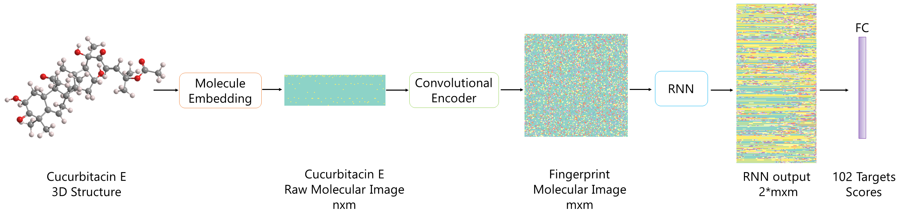

# **PharmaNet: Pharmaceutical discovery with deep recurrent neural networks.**

This repository provides a PyTorch implementation of PharmaNet, presented in the paper [PharmaNet: Pharmaceutical discovery with deep recurrent neural networks](https://journals.plos.org/plosone/article?id=10.1371/journal.pone.0241728). PharmaNet is a novel approach for the task of Drug-Protein interaction based on Recurrent Neural Networks to analyze SMILES representations drugs.

# **Overview**

# **Pretrained Models**

Pretrained models for each fold of our 4 fold cross-validation are available in this [link](https://drive.google.com/drive/folders/1o6-1vET_YzMng0NiUbJ2MHWSlowPNj_K?usp=sharing). 

# **Requirements**
* Pytorch >= 1.4
* Pandas 
* Tqdm
